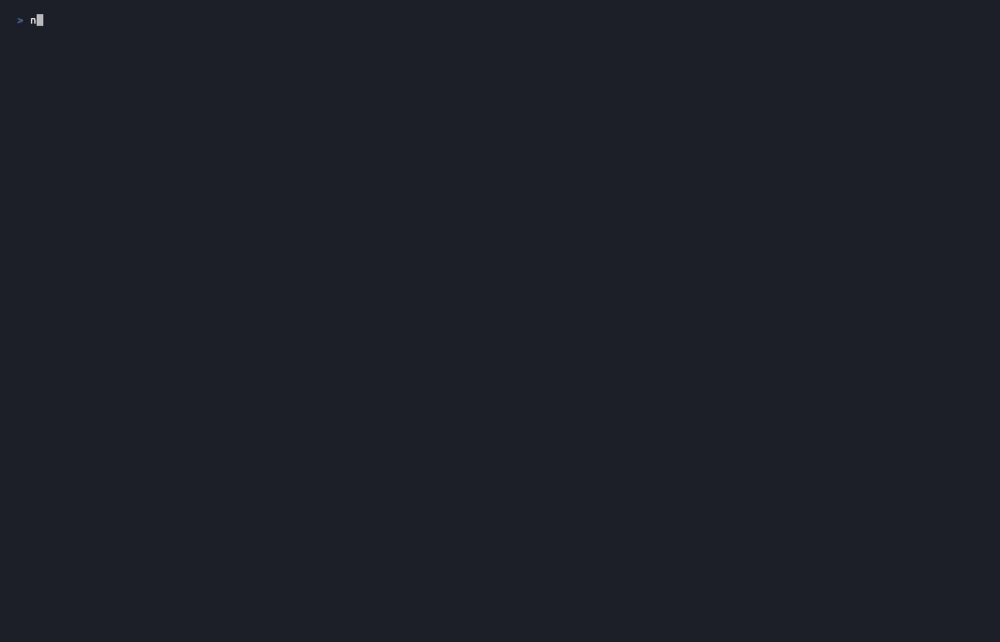

# terminaltui

[](https://github.com/OmarMusayev/terminaltui/actions/workflows/ci.yml) [](https://www.npmjs.com/package/terminaltui) [](LICENSE)    [](https://terminaltui.dev)

> **Next.js for the terminal.** Write a `pages/` directory of TypeScript files. Get an interactive TUI with file-based routing, components, and themes. Distribute it with `npx` — or host it and let people `ssh` in.

**🌐 [terminaltui.dev](https://terminaltui.dev)** &nbsp;·&nbsp; **📦 [npm](https://www.npmjs.com/package/terminaltui)** &nbsp;·&nbsp; **🚀 [Try it: `npx terminaltui try`](#quick-start)**


*Try it yourself: `npx terminaltui try` — this GIF predates the v2 renderer; the frames are provably identical, so it never needed re-recording.*

## Quick Start

```bash
npx terminaltui init my-site
cd my-site
npx terminaltui dev
```

Or try a built-in demo instantly — zero install, zero scaffold:

```bash
npx terminaltui demo restaurant
```

**Requirements:** Node.js **>= 18** (relies on the built-in `fetch`). The package is **ESM-only** — load it with `import`, not `require()`.

---

## What is this?

terminaltui is a **framework** for building interactive terminal apps in TypeScript. You write pages, it handles routing, navigation, layout, state, and rendering. Users run your app with a single `npx` command, or you host it over SSH and they connect with `ssh`. No browser, no Electron, no React.

If you've used Next.js, you already know the shape: `pages/about.ts` becomes `/about`, `pages/projects/[slug].ts` is a dynamic route, `api/stats.ts` is a `GET /api/stats` endpoint.

**How it compares:**

|  | terminaltui | [Ink](https://github.com/vadimdemedes/ink) | [Pastel](https://github.com/vadimdemedes/pastel) | [Bubble Tea](https://github.com/charmbracelet/bubbletea) |
|---|---|---|---|---|
| Lang | TypeScript | TypeScript (React) | TypeScript (Ink-based) | Go |
| Shape | **Framework** (pages, routing, layouts) | Component library | CLI command router | TUI framework (Elm-style) |
| File-based routing for **screens** | Yes | No | No (routes CLI subcommands) | No |
| SSH hosting | `terminaltui serve` (`ssh2` peer dep) | No | No | Via `charmbracelet/wish` |
| `npx` distribution | First-class | First-class | First-class | No (Go binary) |
| Components included | 30+ | Bring your own | Inherits from Ink | Via `bubbles` |
| AI codegen-native | `claude/SKILL.md` ships in package | No | No | No |

---

## What's new in 2.0

> v2 gives terminaltui a production-grade engine: components now remember their state by where they live, not what they're labeled — so state survives navigation and two same-named accordions stop sharing a brain — and a new line-diffed renderer writes 67.7% fewer bytes to your terminal (269,355 → 87,027 across a 41-keypress scripted nav at 120x40), and exactly zero when nothing changed, which your users feel most over SSH. We didn't take the overhaul on faith: a dual-terminal oracle proved every final frame byte-identical to v1, and 3,323 tests across 52 suites — including a full demo sweep through a real PTY emulator — block every merge. Same pixels, a third of the bytes.

**Migration note (breaking):** component state (accordions, tabs, galleries, button loading) is now keyed by page + tree position instead of display label. Two same-labeled components no longer share state, and state persists across navigation — correct behavior, but observably different if your app relied on the old label sharing. Details in the [CHANGELOG](CHANGELOG.md).

---

## Project Structure

Each page is its own file. A top-level `config.ts` handles theme and settings.

```
my-site/
├── config.ts          # theme, banner, global settings
├── pages/
│   ├── home.ts        # landing page
│   ├── about.ts       # /about
│   ├── projects/
│   │   ├── index.ts   # /projects
│   │   └── [slug].ts  # /projects/:slug (dynamic route)
│   └── contact.ts     # /contact
├── api/
│   └── stats.ts       # GET /api/stats
└── components/        # reusable blocks
```

**config.ts**

```ts
import { defineConfig } from "terminaltui";

export default defineConfig({
  name: "My Site",
  theme: "cyberpunk",
  banner: { text: "MY SITE", font: "ANSI Shadow" },
});
```

**pages/about.ts**

```ts
import { card, timeline } from "terminaltui";

export const metadata = { label: "About", icon: "?" };

export default function About() {
  return [
    card({ title: "About Me", body: "Full-stack developer based in Portland." }),
    timeline([
      { date: "2024", title: "Started terminaltui" },
      { date: "2023", title: "Joined Acme Corp" },
    ]),
  ];
}
```

---

## Features

### 30+ Components

Cards, tables, timelines, forms, progress bars, galleries, tabs, accordions, and more.

```ts
row([
  col([card({ title: "Revenue", body: "$1.2M" })], { span: 4 }),
  col([card({ title: "Users", body: "45,231" })], { span: 4 }),
  col([card({ title: "Uptime", body: "99.97%" })], { span: 4 }),
])
```

### 12-Column Grid System

Bootstrap-style responsive grid with automatic spatial navigation.

```ts
row([
  col([statsCard], { span: 3, xs: 12 }),
  col([chartCard], { span: 9, xs: 12 }),
], { gap: 1 })
```

Breakpoints: xs (<60 cols), sm (60-89), md (90-119), lg (>=120). Rows auto-wrap.

### Spatial Navigation

Arrow keys move to the nearest item on screen -- like a TV remote. No configuration needed. Works automatically with all layouts.

| Key | Action |
|-----|--------|
| Up/Down or j/k | Move to nearest item above/below |
| Left/Right or h/l | Move to nearest item left/right |
| Enter | Activate |
| Escape | Go back |
| Tab | Sequential fallback |
| 1-9 | Jump to page |

### 10 Themes



cyberpunk, dracula, nord, monokai, solarized, gruvbox, catppuccin, tokyoNight, rosePine, hacker. Plus custom themes.

```ts
export default defineConfig({ theme: "dracula" });
```

### ASCII Art Engine


14 fonts, 15 scenes, 30+ icons, data visualization, image-to-ASCII conversion.

### Images

```ts
image("./cover.png", { width: 60 })
image("./nebula.jpg", { width: 40, resizable: true })   // viewer can grow it
image("./poster.jpg", { fitPage: true, border: true })  // sizes itself to the page
```

Real PNGs and JPEGs -- no `sharp`, no native build, nothing to install. On kitty and Ghostty they are drawn as **real pixels** via the kitty graphics protocol; everywhere else as colored cells, each one a Unicode block glyph with its own foreground and background, so images work on Apple Terminal, over SSH, and inside tmux. The path is negotiated from the viewer's terminal -- pixels, six cell tiers from 2x2 quadrants down to a plain ASCII ramp, and a bordered alt box on any failure, all at exactly the same row count. `resizable: true` lets the viewer resize a frame with `+`/`-`, and because the engine samples per cell, a bigger frame is a fresh resample with genuinely more detail. `fitPage: true` deletes the hand-picked `width` entirely: the image takes whatever rows the page has left, so a page meant to be seen at once fits at any window size and re-fits on resize. See [docs/images.md](docs/images.md).

### Video

```ts
video("./trailer.mp4", { fitPage: true, controls: true })  // Space plays, arrows scrub
video("./loop.gif", { autoplay: true, width: 40 })         // zero tooling required
```

Moving pictures, through the same cell engine -- and **with no video decoder at runtime**. A source is packed once, ahead of time, into a `.tvf` frame pack of small pre-scaled JPEGs; playback is a 0.6 ms decode into the existing resample-fit-write path, about 5% of a 24fps frame budget. ffmpeg is needed to *pack* an mp4 and never to play one, and a `.gif` needs nothing at all because the GIF decoder is pure TypeScript. Playback is cells on every terminal including kitty, because per-frame pixel transmission measures 37-44 MiB/s against the quadrant tier's 1.26 -- so the wire, not the CPU, is the ceiling. `autoplay` defaults to false so a page stays screenshottable, and `TERMINALTUI_VIDEO=off` freezes every video absolutely. See [docs/video.md](docs/video.md).

### Forms & Inputs

TextInput, TextArea, Select, Checkbox, Toggle, RadioGroup, NumberInput, SearchInput, Button. Validation, submission, notifications.

### File-Based API Routes

```ts
// api/stats.ts
export async function GET() {
  return { users: 45231, uptime: 99.97 };
}
```

File path maps to endpoint: `api/stats.ts` -> `GET /api/stats`. Framework starts a local server automatically.

### Reactive State

```ts
const count = createState({ visitors: 0 });

dynamic(() => [text(`Visitors: ${count.get("visitors")}`)]);
```

`createState`, `computed`, `dynamic`, `createPersistentState`, `fetcher`, `request`, `liveData`.

Component state (accordions, tabs, galleries, button loading) is keyed by page + tree position — it survives navigation and refresh, stays isolated per page, and two same-labeled components never share state.

Rendering is line-diffed: only rows that changed are repainted, and a frame with no changes writes zero bytes.

---

## Demos

No setup needed -- run any demo straight from npm:

```bash
npx terminaltui demo restaurant
npx terminaltui demo dashboard
npx terminaltui demo band
npx terminaltui demo coffee-shop
npx terminaltui demo conference
npx terminaltui demo developer-portfolio
npx terminaltui demo freelancer
npx terminaltui demo startup
npx terminaltui demo server-dashboard
npx terminaltui demo mac-monitor   # macOS only — live system stats
```

| Demo | Theme | Highlights |
|------|-------|------------|
| Restaurant | gruvbox | Tabbed menu, reservation form, split layout |
| Dashboard | hacker | Live API data, persistent state, parameterized routes |
| Band | rosePine | Album cards, tour dates, mailing list |
| Coffee Shop | catppuccin | Tabbed menu, catering form |
| Conference | nord | Schedule tabs, speaker grid, sponsor tiers |
| Developer Portfolio | cyberpunk | Skill bars, sparklines, project grid |
| Freelancer | custom | Testimonial quotes, contact form |
| Startup | tokyoNight | Pricing tiers, feature accordion |
| Server Dashboard | hacker | System metrics, container table, log stream |
| Mac Monitor | hacker | Live macOS system stats (CPU/mem/GPU/disk/net/battery/processes), dynamic routes for per-process detail — darwin only |

### Restaurant


### Dashboard (live API data)


---

## CLI

```bash
terminaltui try                # run a 5-page guided tour — zero install, zero config
terminaltui init [tpl|name]    # scaffold a new project — arg is a template (minimal, portfolio, landing, restaurant, blog, creative) or your site name
terminaltui create             # interactive prompt builder — describe what you want, AI builds it
terminaltui convert            # drop terminaltui docs into your project for AI-assisted conversion
terminaltui validate           # check a file-based routing project for common issues
terminaltui dev [path]         # start development preview (auto-starts API server if routes defined)
terminaltui serve [path]       # host your TUI over SSH
terminaltui demo [name]        # run a built-in demo
terminaltui build              # bundle for npm publish (includes API routes)
terminaltui test               # run automated tests on the site in the current directory
terminaltui art                # manage art assets (list, preview, create, validate)
terminaltui help               # show help
```

---

## SSH Hosting

Host any TUI app over SSH -- anyone can connect with `ssh` and see it rendered in their terminal, zero install required. Think `ssh chat.shazow.net` but for any terminaltui project.

v2 writes 67.7% fewer bytes per session, and idle frames cost zero bandwidth — over ssh, that's latency you can feel.

The `serve` command needs [`ssh2`](https://www.npmjs.com/package/ssh2), an optional peer dependency — install it in your project first:

```bash
npm install ssh2
terminaltui serve --port 2222
```

If terminaltui is installed globally (or run via zero-install `npx`), it also picks up an `ssh2` installed in the project directory you run `serve` from; alternatively, install it globally too with `npm install -g ssh2`.

Then from any machine:

```bash
ssh localhost -p 2222
```

Each connection gets an independent session. Arrow keys, forms, navigation -- everything works.

| Flag | Default | Description |
|------|---------|-------------|
| `--port <N>` | 2222 | SSH port |
| `--host-key <path>` | `.terminaltui/host_key` | Host key path (auto-generated) |
| `--max-connections <N>` | 100 | Max simultaneous connections |

---

## See It Live

```bash
npx omar-musayev
```

A real portfolio built with terminaltui.

---

## Testing

terminaltui ships a headless emulator (`terminaltui/emulator`) — think Playwright, but the browser is a terminal. It spawns your app in a PTY, scripts keypresses, and lets you assert on the rendered grid:

```ts
import { TUIEmulator } from "terminaltui/emulator";

const emu = await TUIEmulator.launch({
  command: "npx terminaltui dev",
  cwd: "./my-site",
  cols: 120,
  rows: 40,
});

await emu.waitForBoot();
emu.assert.textVisible("MY SITE");

await emu.press("down");
await emu.press("enter");
await emu.waitForText("About Me");
emu.assert.currentPage("about");

// New in 2.0: assert your app's render cost in CI
emu.resetBytesReceived();
await emu.press("escape");
await emu.waitForIdle();
console.log(`repaint cost: ${emu.bytesReceived} bytes`);

await emu.close();
```

Beyond the basics: `screen.text()` / `screen.cells()` for raw grid access, `screen.menu()` / `screen.cards()` / `screen.links()` for structural queries, `navigateTo()` for menu-aware navigation, `resize()` for breakpoint tests, and a recorder for replayable scripts. It's the same emulator the framework's own test suite and the v2 render benchmark run through. See [docs/testing.md](docs/testing.md).

---

## Performance

Method: measured with the built-in emulator driving a 41-keypress scripted navigation at 120x40; medians of 3 runs. The metric is **bytes written to the terminal** — not a speed claim.

| Scenario | Change in bytes written (v1 → v2) |
|----------|-----------------------------------|
| demos/startup | −69.0% |
| demos/developer-portfolio | −66.2% |
| **Combined total** | **269,355 → 87,027 (−67.7%)** |

- Frames with no changes write **0 bytes**.
- Equivalence, not vibes: a dual-VirtualTerminal oracle ran old and new renderers side by side and proved the final grids **byte-identical**.
- Measure your own app the same way with [`TUIEmulator.bytesReceived`](#testing) (byte totals are comparable within the same PTY backend on the same machine).

---

## For AI Agents

terminaltui ships with `claude/SKILL.md` -- a 2,500+ line API reference designed for AI code generation. The `terminaltui create` and `terminaltui convert` commands generate tailored prompts for Claude Code.

---

## Documentation

| Doc | What's in it |
|-----|-------------|
| [docs/getting-started.md](docs/getting-started.md) | Install, scaffold, run your first project |
| [docs/cli-reference.md](docs/cli-reference.md) | Every CLI command with flags and examples |
| [docs/components.md](docs/components.md) | Component catalog with examples |
| [docs/layouts.md](docs/layouts.md) | Grid system, spatial navigation, layout patterns |
| [docs/routing.md](docs/routing.md) | File-based routing, dynamic routes, middleware |
| [docs/api-routes.md](docs/api-routes.md) | File-based HTTP API server (api/*.ts) |
| [docs/state-data.md](docs/state-data.md) | createState, computed, dynamic, fetcher, liveData |
| [docs/themes.md](docs/themes.md) | The 10 built-in themes + how to write your own |
| [docs/images.md](docs/images.md) | Rendering PNG/JPEG -- kitty pixels, cell tiers, detection, resizable frames, caching |
| [docs/video.md](docs/video.md) | Playing video -- frame packs, the pack CLI, GIF support, the frame budget, tearing |
| [docs/ascii-art.md](docs/ascii-art.md) | Banners, scenes, icons, dataviz, image-to-ASCII |
| [docs/serve.md](docs/serve.md) | SSH hosting (`terminaltui serve`) |
| [docs/testing.md](docs/testing.md) | Headless TUI emulator |
| [docs/create-command.md](docs/create-command.md) | The interactive prompt builder |
| [claude/SKILL.md](claude/SKILL.md) | Full API reference for AI code generation |
| [CHANGELOG.md](CHANGELOG.md) | Version history |
| [ARCHITECTURE.md](ARCHITECTURE.md) | Codebase structure and design decisions |

---

## Tech Stack

- **TypeScript** -- strict mode, zero `any` in public API
- **3 required dependencies** (esbuild, pngjs, jpeg-js) -- all pure JavaScript, no native builds; ssh2 is an optional peer dependency for `serve`
- **2,713 tests across 41 suites** in the default run, all blocking in CI (~1 minute); `npx tsx test/run-all.ts --demos` adds the PTY-driven sweep of every bundled demo, for 3,600+ tests across 60 suites
- **Apple Terminal compatible** -- truecolor on Terminal.app 470+ (macOS 26), automatic 256-color fallback below that

## Contributing

Issues and PRs welcome at [github.com/OmarMusayev/terminaltui](https://github.com/OmarMusayev/terminaltui).

## License

[MIT](LICENSE)
